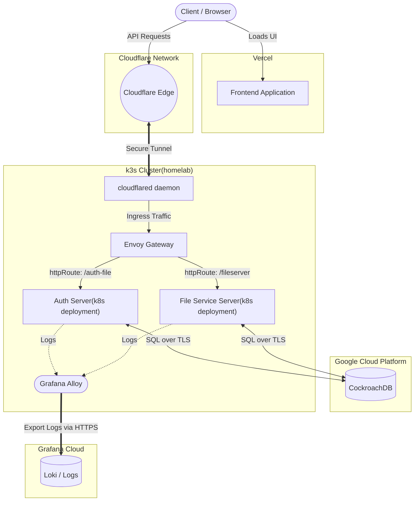

실행방법
---
[app.mikekim1032.shop/login](https://app.mikekim1032.shop/login])
> 접속 후 플로우 댓글에 제공된 이메일 비밀번호로 로그인

차단 정책 스키마
---
```sql
CREATE TABLE blocked_extension (
    id UUID NOT NULL,
    name VARCHAR(20) NOT NULL,
    deleted_at TIMESTAMPTZ NULL,
    created_by_member_id UUID NOT NULL,
    deleted_by_member_id UUID NULL,
    team_id UUID NOT NULL,
    CONSTRAINT blocked_extension_pkey PRIMARY KEY (id ASC),
    INDEX idx_blocked_extension_team_deleted (team_id ASC, deleted_at ASC)
);
```


Architecture
---

#

이외 member, team, metadata 스키마
---
```sql
CREATE TABLE public.member (
    id UUID NOT NULL,
    team_id UUID NOT NULL,
    email STRING NOT NULL,
    name STRING NOT NULL,
    password STRING NOT NULL,
    "role" STRING NOT NULL,
    CONSTRAINT member_pkey PRIMARY KEY (id ASC)
);
```
```sql
CREATE TABLE public.team (
  number_of_blocked_custom_extensions INT8 NOT NULL,
  id UUID NOT NULL,
  name STRING NOT NULL,
  CONSTRAINT team_pkey PRIMARY KEY (id ASC)
);
```

```sql
CREATE TABLE public.metadata (
    id UUID NOT NULL,
    name VARCHAR(255) NOT NULL,
    extension VARCHAR(255) NOT NULL,
    created_by_member_id UUID NOT NULL,
    deleted_at TIMESTAMPTZ NULL,
    deleted_by_member_id UUID NULL,
    team_id UUID NOT NULL,
    CONSTRAINT metadata_pkey PRIMARY KEY (id ASC)
);
```